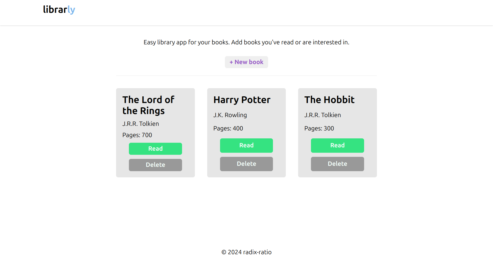

# Librarly

A simple library app project built with HTML, CSS, and JavaScript, created as part of The Odin Project's Full Stack JavaScript curriculum.

## Description

This project is a basic implementation of a Library with, allowing users to create and manage books in a library. The library includes features for adding, removing, and listing books.

## Features

* Create and manage books in a library
* Add books with title, author, and number of pages 
* Remove books from the library
* List all books in the library

## Demo

[**Live Demo**](https://radix-ratio.github.io/librarly) | [**Project Specs**](https://www.theodinproject.com/lessons/node-path-javascript-library)

## Screenshots

## Getting Started

1. Clone the repository to your local machine.
2. Open the `index.html` file in a web browser to run the application.

## License

This project is licensed under the MIT License. See [`LICENSE`](https://choosealicense.com/licenses/mit/) for details.

## Acknowledgments

- The Odin Project for providing the curriculum and resources
- Flaticon for providing icons

## Authors

- [@radix-ratio](https://www.github.com/radix-ratio)